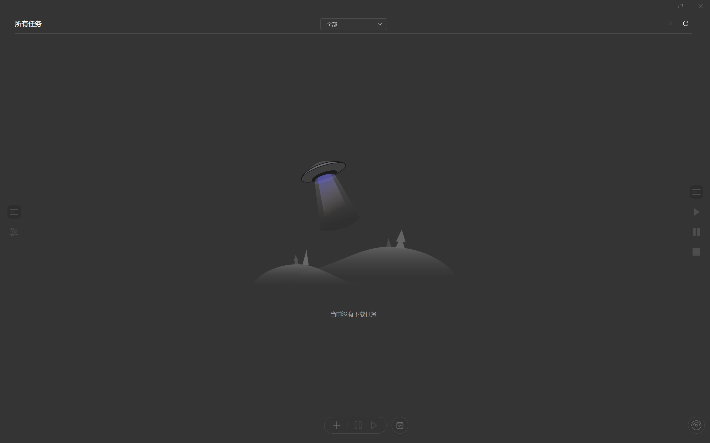

<p align="right"><a href="./README-CN.md">简体中文</a></p>

# LinkCore Download Manager

<p align="center">
  
</p>

<p align="center">
  <a href="https://github.com/HuanXinStudio/LinkCore-Download-Manager/releases">
    
  </a>
  <a href="https://github.com/HuanXinStudio/LinkCore-Download-Manager/releases">
    
  </a>
  <a href="#platforms">
    
  </a>
  <a href="https://github.com/HuanXinStudio/LinkCore-Download-Manager/blob/master/LICENSE">
    
  </a>
</p>


## 📖 Overview

LinkCore Download Manager is a powerful, cross-platform download manager built with modern web technologies. It provides a clean, intuitive interface while supporting a wide range of download protocols, making it an ideal choice for all your downloading needs.

Originally forked from <a href="https://github.com/agalwood/Motrix">Motrix</a>, LinkCore has been enhanced with improved performance, a refined user interface, and additional features to deliver an exceptional downloading experience.

## ✨ Key Features

### 🚀 Performance & Reliability
- **High-Speed Downloads**: Optimized for maximum download performance
- **Multi-Threading**: Support for up to 64 threads per task
- **Concurrent Downloads**: Manage up to 10 simultaneous download tasks
- **Stable Connections**: Robust error handling and automatic retry mechanisms

### 📁 Protocol Support
- **HTTP/HTTPS**: Direct downloads from web servers
- **FTP/SFTP**: File transfers from FTP servers
- **BitTorrent**: Full torrent file support with selective downloading
- **Magnet Links**: Instant torrent downloads without .torrent files

### 🎨 User Experience
- **Clean Interface**: Modern, intuitive design with dark mode support
- **System Tray Integration**: Quick access and status monitoring
- **Download Notifications**: Real-time alerts when downloads complete
- **Speed Control**: Set upload and download speed limits
- **File Management**: Organize downloads by category and location

### 🔧 Advanced Features
- **Tracker Updates**: Daily automatic tracker list updates for improved torrent performance
- **UPnP/NAT-PMP**: Automatic port mapping for better connectivity
- **User-Agent Spoofing**: Customize user-agent strings for compatibility
- **Task Scheduling**: Set download times and priorities
- **Batch Downloads**: Import and export download lists

### Unique Features

- **Auto Categorization**: Automatically save files by type
- **Custom Categories**: Define your own rules for file categorization
- **Task Priority Value**: Set numeric priorities to influence download order and resource allocation
- **Custom Download Suffix**: Configure a temporary suffix for downloading files for easier management
- **Set File Modified Time to Completion Time**: Optionally set the file's modification time to the moment the download finishes
- **Quick Engine Switching**: Switch between different download engines quickly to suit various scenarios
- **Advanced Option Presets**: Name, save, select, and delete presets for advanced options
- **Link Input UX Enhancements**: Automatically deduplicate links; auto-append newline and place caret after paste or autofill

## 🖥️ Platforms

LinkCore Download Manager is currently available for:
- **Windows** (7, 8, 10, 11)

> **Note**: macOS and Linux support may be added in future releases. Stay tuned for updates!

## 📦 Installation

### Windows

1. Visit the [GitHub Releases](https://github.com/HuanXinStudio/LinkCore-Download-Manager/releases) page
2. Download the latest `LinkCore-Download-Manager-Setup-x.y.z.exe` installer
3. Run the installer and follow the on-screen instructions

## 🖥️ Screenshots

<p align="center">
  
  <br>
  <em>Task Management Interface</em>
</p>

## 🚀 Quick Start

### Basic Usage

1. **Add a Download Task**:
   - Click the "+ New Download" button
   - Enter the download URL or upload a torrent file
   - Configure download settings (optional)
   - Click "OK" to start downloading

2. **Manage Downloads**:
   - Pause/resume downloads with a single click
   - Monitor download progress in real-time
   - View detailed information about each task

3. **Torrent Downloads**:
   - Select specific files to download from a torrent
   - View peer and seed information
   - Adjust torrent-specific settings

### Keyboard Shortcuts

- `Ctrl/Cmd + N`: New download task
- `Ctrl/Cmd + R`: Resume selected task(s)
- `Ctrl/Cmd + P`: Pause selected task(s)
- `Ctrl/Cmd + D`: Delete selected task(s)
- `Ctrl/Cmd + Q`: Quit the application

## Tips

- In the “Add Task” dialog, you can set a numeric priority for each parsed item. Higher values get scheduled earlier while low-priority tasks are interleaved to keep allocation fair. Priorities are shown on the task card and in the detail panel, and persist across restarts.
- “Advanced Options” support named presets for quick reuse (UA, Referer, Cookie, proxy, etc.). Saving is blocked when all fields are empty, with a localized warning.

## 🛠️ Development

### Prerequisites

- Node.js (v16.0.0 or higher)
- npm or yarn
- Git

### Setup

1. Clone the repository:
   ```bash
   git clone https://github.com/HuanXinStudio/LinkCore-Download-Manager.git
   cd LinkCore-Download-Manager
   ```

2. Install dependencies:
   ```bash
   npm install
   # or
   yarn install
   ```

3. Start development server:
   ```bash
   npm run dev
   ```

4. Build for production:
   ```bash
   npm run build
   ```

### Project Structure

```
LinkCore-Download-Manager/
├── src/                  # Main source code
│   ├── main/             # Electron main process
│   ├── renderer/         # Electron renderer process (Vue.js)
│   └── shared/           # Shared utilities
├── static/               # Static assets
├── .electron-vue/        # Electron-Vue configuration
├── screenshots/          # Screenshots for documentation
├── package.json          # Project configuration
└── README.md             # This file
```

## 🤝 Contributing

Contributions are welcome! Whether you're fixing bugs, adding new features, or improving documentation, your help is appreciated.

### How to Contribute

1. Fork the repository
2. Create a new branch (`git checkout -b feature/your-feature`)
3. Make your changes
4. Commit your changes (`git commit -m 'Add some feature'`)
5. Push to the branch (`git push origin feature/your-feature`)
6. Create a Pull Request

### Development Guidelines

- Follow the existing code style
- Write clear, concise commit messages
- Include tests for new features
- Update documentation as needed

## 📄 License

LinkCore Download Manager is licensed under the [MIT License](LICENSE).

## 🙏 Credits

- **Original Project**: [Motrix](https://github.com/agalwood/Motrix) by Dr_rOot
- **UI Framework**: [Vue.js](https://vuejs.org/)
- **Desktop Framework**: [Electron](https://www.electronjs.org/)
- **Torrent Library**: [WebTorrent](https://webtorrent.io/)

## 📞 Support

If you encounter any issues or have questions:

- Open an [issue](https://github.com/HuanXinStudio/LinkCore-Download-Manager/issues) on GitHub
- Join our community for discussions and support

---

<p align="center">
  Made by HuanXinStudio
</p>
